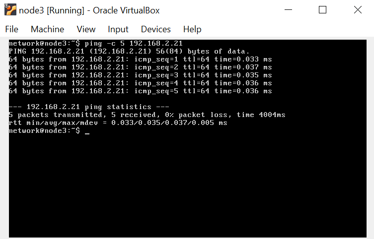
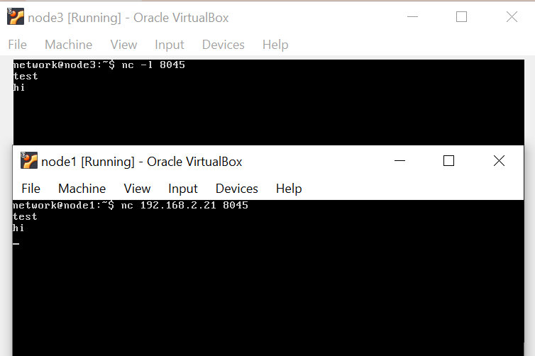
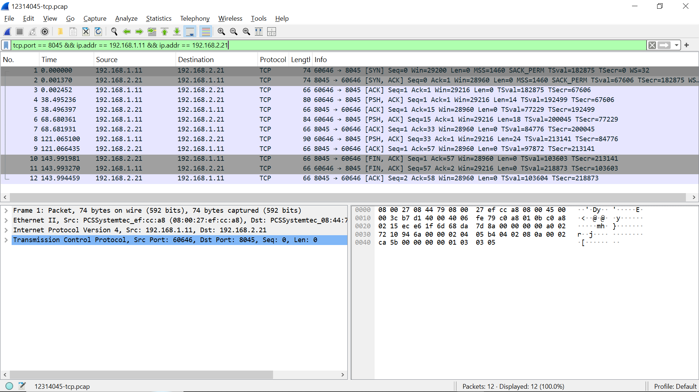

# COIT20262 Advanced Network Security — Week 1 Journal

**Student ID:** 12314045  
**Topic:** Introduction to Network Security and virtnet

## Work completed

This week I prepared the virtual networking environment that is used throughout the unit. I created the required shared storage area for practical evidence and set up **virtnet topology 5**, consisting of **node1, node2 and node3**. This topology is important for later packet-capture and interception activities because node2 can observe traffic travelling between the client and server.

I verified the network configuration on node3 and tested connectivity between the virtual machines. The main commands/tools used were:

```bash
ifconfig
ping
netcat
nano
```

`ifconfig` was used to identify the IP configuration of node3. I then used `ping` from node1 to node3 to confirm that the hosts could communicate. After basic connectivity was confirmed, I used **netcat** to test TCP message delivery between node1 and node3.

On node2 I created a small text file with `nano`. I also practised transferring files from the Linux VM to the host computer using **FileZilla/WinSCP**, which is useful for collecting evidence and submission files.

## Packet capture activity

I generated ICMP traffic by pinging **node3 from node1** while capturing the traffic on **node2**. The capture was saved as `ping.pcap` and opened in Wireshark. In Wireshark I checked the source and destination addresses and observed the ICMP Echo Request and Echo Reply packets.

This activity demonstrated that a device positioned on the traffic path can capture and inspect packets exchanged by other hosts. It also provided the practical foundation for the TCP interception work used later in Assignment 1.

## Evidence









## Key learning

The main outcome from Week 1 was successfully establishing and testing the virtnet environment. I also gained practical experience with Linux networking commands, TCP communication, file transfer and basic Wireshark packet analysis.
