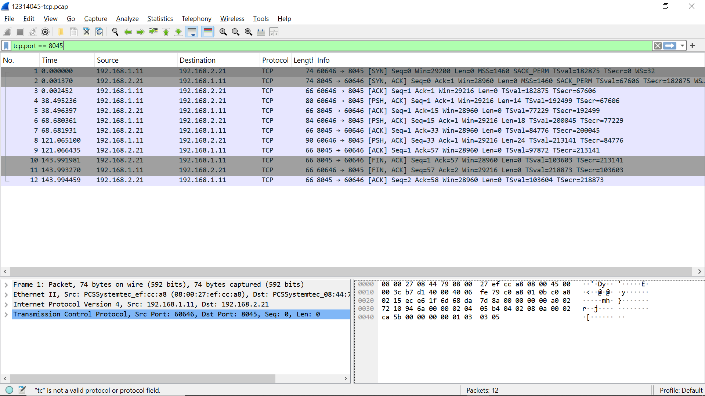
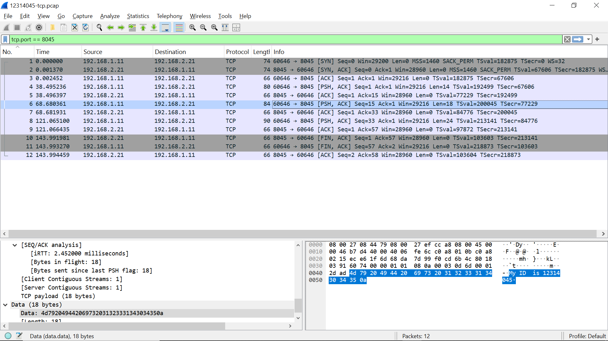
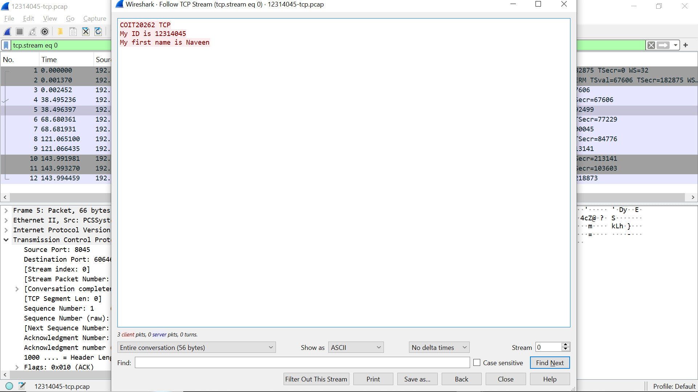
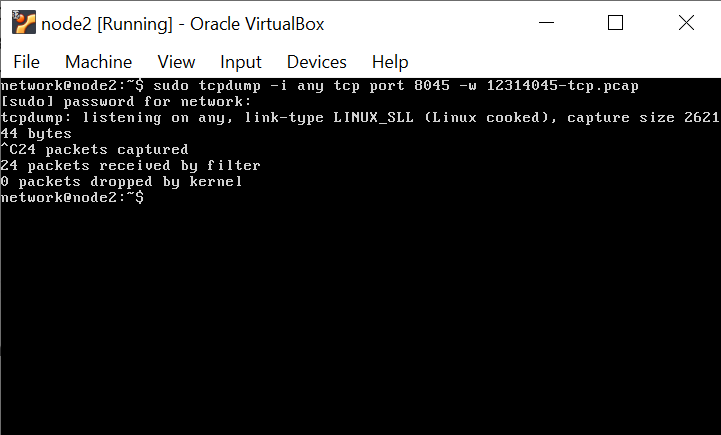

# COIT20262 Advanced Network Security — Week 2 Journal

**Student ID:** 12314045
**Topic:** TCP Packet Capture and Analysis

## Work Completed

This week I worked with **virtnet topology 5** to perform TCP packet capture and analysis. In the topology, **node1** operated as the client, **node2** acted as the router and packet-capture point, and **node3** operated as the Netcat server.

For student ID `12314045`, the last three digits are `045`. Therefore, the required TCP server port was:

```text
8045
```

I started the Netcat TCP server on node3 using port `8045`. Packet capture was performed on node2 using `tcpdump`. From node1, I connected to the Netcat server and transmitted the required application data:

```text
COIT20262 TCP
My ID is 12314045
My first name is Naveen
```

After the communication finished, I stopped the packet capture and saved the result as:

```text
12314045-tcp.pcap
```

## Wireshark Analysis

I opened `12314045-tcp.pcap` in Wireshark and filtered the capture to examine only the required TCP communication.

The captured TCP connection was:

```text
Client IP:       192.168.1.11
Client Port:     60646
Server IP:       192.168.2.21
Server Port:     8045
Protocol:        TCP
```

The capture contained **12 TCP packets**. The connection started with the standard TCP three-way handshake:

```text
SYN
SYN, ACK
ACK
```

After the connection was established, three `PSH, ACK` segments carried the application data from the client to the server. The server acknowledged each transmission.

The captured payloads were:

```text
COIT20262 TCP
My ID is 12314045
My first name is Naveen
```

The connection was then closed using `FIN, ACK` packets followed by the final acknowledgement.

## Follow TCP Stream

I used **Follow TCP Stream** in Wireshark to reconstruct the application-layer data contained in the TCP session. The reconstructed stream displayed:

```text
COIT20262 TCP
My ID is 12314045
My first name is Naveen
```

This confirmed that the complete message entered at node1 was transported to node3 and could be recovered from the packet capture.

## Evidence

The following screenshots were recorded as evidence of the practical work:











* `week2-wireshark-tcp-session.png` — complete TCP exchange on port 8045.
* `week2-tcp-payload.png` — TCP packet containing the student ID in the payload.
* `week2-follow-tcp-stream.png` — reconstructed application messages using Follow TCP Stream.
* `week2-netcat-tcpdump.png` — Netcat communication and packet-capture activity.

## Assignment Connection

This practical work directly supports **Assignment 1 Question 1: Packet Capture and Analysis**. The generated `12314045-tcp.pcap` file provides the evidence required to analyse the TCP exchange and construct the TCP message sequence diagram.

## Key Learning

This activity improved my understanding of how a TCP session operates in practice. I observed the **three-way handshake**, application-data transfer using `PSH, ACK`, TCP acknowledgements and connection termination using `FIN, ACK`.

The exercise also demonstrated that TCP itself does not provide confidentiality. Because the Netcat application data was transmitted as plaintext, Wireshark could reconstruct the complete message using **Follow TCP Stream**. This shows why sensitive application traffic should normally be protected using cryptographic protocols such as TLS.
