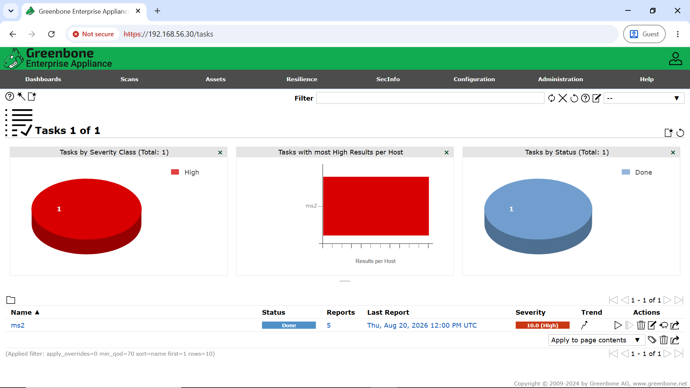
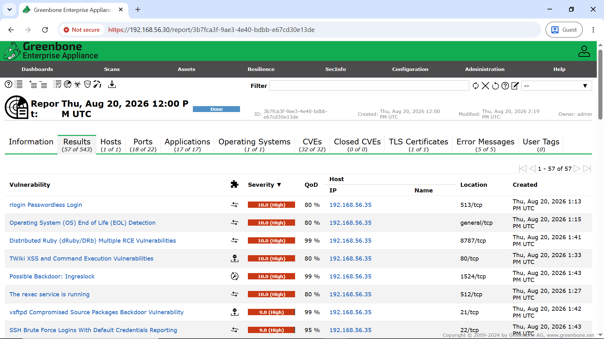
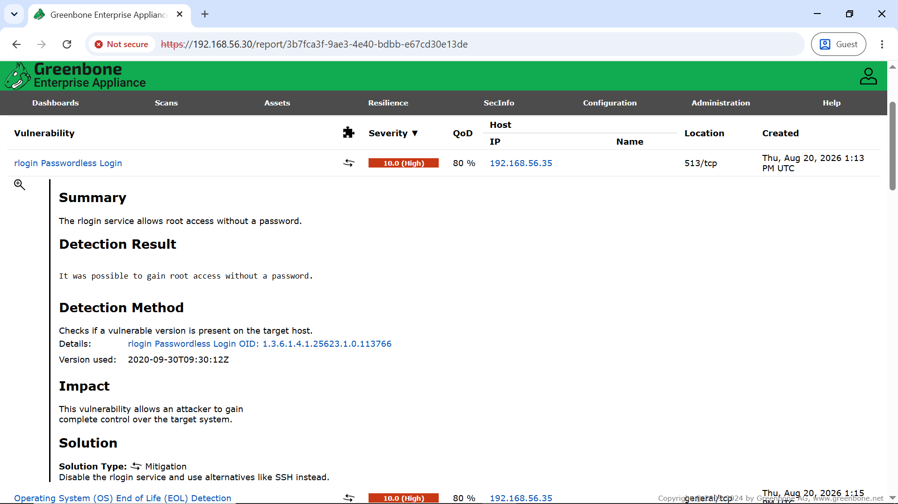
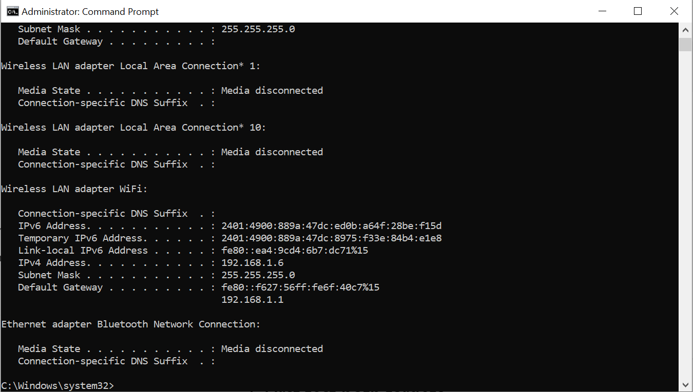
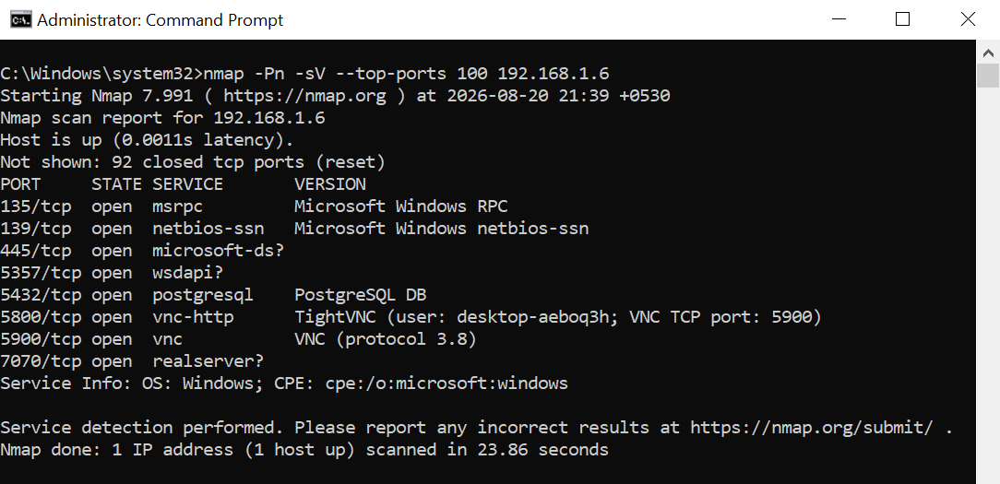
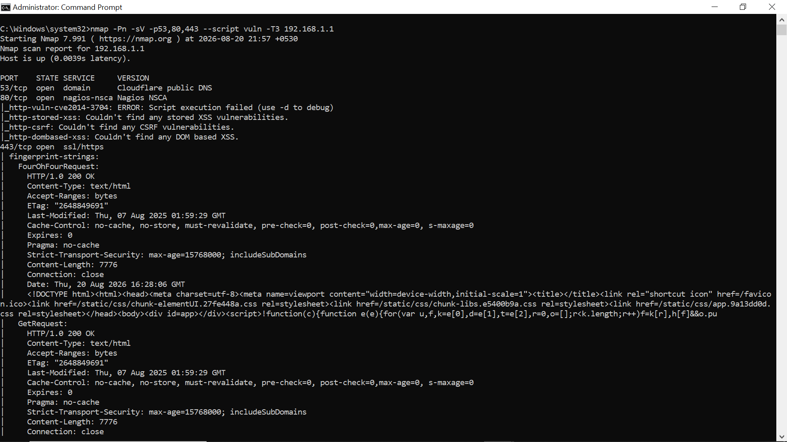

# COIT20262 Advanced Network Security — Week 3 Journal

**Student ID:** 12314045
**Topic:** Vulnerability Analysis and Private Device Scanning

## Work Completed

This week I worked with **Greenbone/OpenVAS**, Metasploitable2 and **Nmap** to identify vulnerabilities and exposed network services. The activities included scanning the intentionally vulnerable Metasploitable2 machine and examining two devices on my own private network.

### Greenbone/OpenVAS Scan of Metasploitable2

I started the Greenbone/OpenVAS virtual machine, accessed the Greenbone web interface and created a target for the **Metasploitable2 (`ms2`)** machine. I then created and executed a vulnerability scan task.

After the scan completed, I reviewed the generated vulnerability report. The completed `ms2` scan against:

```text
192.168.56.35
```

reported:

```text
22 High findings
31 Medium findings
4 Low findings
```

The scan therefore showed that the intentionally vulnerable Metasploitable2 machine contained numerous serious security weaknesses.

Important high-severity findings included:

* `rlogin Passwordless Login`
* Operating System End of Life detection
* Distributed Ruby remote-code-execution vulnerabilities
* TWiki XSS and command-execution vulnerabilities
* Possible Ingreslock backdoor
* `rexec` service exposure
* vsftpd compromised-source-package backdoor vulnerability
* SSH/default-credential-related findings

One of the most serious results was:

```text
rlogin Passwordless Login
Severity: 10.0 (High)
Port: 513/tcp
```

The detailed Greenbone result stated that the `rlogin` service allowed **root access without a password**. This represents a critical authentication weakness because an attacker able to reach the service could potentially obtain privileged access without supplying valid credentials.

The Greenbone report also demonstrated the risks of running obsolete operating systems, insecure legacy remote-access protocols and vulnerable network services.

## Private Device Vulnerability Scanning with Nmap

I also performed vulnerability-related searches against **two devices on my own private network** using Nmap.

Before scanning, I used:

```cmd
ipconfig
```

to identify my local network configuration.

The relevant values were:

```text
Windows Computer: 192.168.1.6
Subnet Mask:      255.255.255.0
Default Gateway:  192.168.1.1
```

This identified my Windows computer as the first device and my home router/default gateway as the second device.

### Device 1 — Windows Computer

I performed an Nmap service and version scan against my Windows computer using:

```cmd
nmap -Pn -sV --top-ports 100 192.168.1.6
```

The scan confirmed that the host was active and identified several accessible TCP services:

```text
135/tcp   open   msrpc
139/tcp   open   netbios-ssn
445/tcp   open   microsoft-ds
5357/tcp  open   wsdapi
5432/tcp  open   postgresql
5800/tcp  open   vnc-http
5900/tcp  open   vnc
7070/tcp  open   realserver?
```

The scan also identified the system as a Windows host. Of particular interest were the **SMB/NetBIOS**, **PostgreSQL** and **TightVNC/VNC** services because these increase the externally reachable attack surface of the computer.

### SMB Vulnerability Check

Because TCP ports `139` and `445` were accessible, I performed an additional Nmap vulnerability-script scan:

```cmd
nmap -Pn -p139,445 --script vuln -T3 192.168.1.6
```

The results included:

```text
139/tcp open netbios-ssn
445/tcp open microsoft-ds

smb-vuln-ms10-054: false
smb-vuln-ms10-061: Could not negotiate a connection
samba-vuln-cve-2012-1182: Could not negotiate a connection
```

The result:

```text
smb-vuln-ms10-054: false
```

shows that this specific vulnerability was **not detected**. The other scripts were unable to complete the required SMB negotiation. Therefore, I did not report these scripts as confirmed vulnerabilities.

However, the exposed SMB and NetBIOS services still represent an important security consideration because file-sharing services are frequently targeted for credential attacks and lateral movement.

### VNC and PostgreSQL Check

I also performed a targeted vulnerability scan against the PostgreSQL and VNC-related ports:

```cmd
nmap -Pn -sV -p5432,5800,5900 --script vuln -T3 192.168.1.6
```

During this scan, the ports were reported as:

```text
5432/tcp filtered postgresql
5800/tcp filtered vnc-http
5900/tcp filtered vnc
```

This indicates that packet filtering or firewall controls prevented Nmap from fully testing these services at that time.

The earlier service scan had nevertheless shown that **TightVNC/VNC** was reachable. Remote-access services should therefore be restricted to trusted hosts and disabled when they are not required.

## Device 2 — Home Router

The second private device was my home router, identified as:

```text
192.168.1.1
```

I performed a targeted Nmap service and vulnerability search against commonly exposed DNS and web-management ports:

```cmd
nmap -Pn -sV -p53,80,443 --script vuln -T3 192.168.1.1
```

The scan identified:

```text
53/tcp   open   domain
80/tcp   open   http
443/tcp  open   ssl/https
```

The Nmap vulnerability scripts did not clearly confirm a major web vulnerability in the displayed results. Some checks reported that no stored XSS, DOM-based XSS or CSRF vulnerability was identified, while another script could not complete successfully.

The result nevertheless confirmed that the router exposes network and web-management services on the local network. These services should be protected using strong administrator credentials, current firmware, HTTPS where possible and restricted management access.

## Main Security Findings

The two most important security exposures identified during the private-device scans were:

### 1. VNC Remote-Access Exposure

TCP ports `5800` and `5900` were associated with TightVNC/VNC on the Windows computer. A remote-access service can provide extensive control of a host if authentication is weak or the service is incorrectly configured.

Recommended controls include:

* Disable VNC if it is not required.
* Keep the VNC software updated.
* Use strong and unique authentication.
* Restrict access using Windows Firewall.
* Allow connections only from trusted systems.
* Avoid exposing VNC directly outside the trusted private network.

### 2. SMB and NetBIOS Exposure

TCP ports `139` and `445` exposed NetBIOS and SMB services. Although the Nmap vulnerability scripts did not confirm the tested SMB vulnerability, unnecessary SMB exposure increases the attack surface.

Recommended controls include:

* Disable unnecessary file-sharing services.
* Keep Windows fully patched.
* Ensure obsolete SMB versions such as SMBv1 remain disabled.
* Restrict TCP port `445` using firewall rules.
* Permit SMB only from trusted systems.
* Monitor failed authentication and unusual file-sharing activity.

## Evidence

The following screenshots were recorded as evidence of the Week 3 practical work:















The Greenbone screenshots demonstrate the completed Metasploitable2 scan and critical findings. The Nmap screenshots demonstrate the discovery and vulnerability-search activities performed against the two private devices.

## Key Learning

The main lesson from Week 3 was the difference between **service discovery**, **security exposure** and a **confirmed vulnerability**.

An open port indicates that a service can be reached, but this does not automatically mean that a known vulnerability exists. Vulnerability-script results must be interpreted carefully. For example, `false`, `filtered` or `could not negotiate` should not be reported as evidence that a vulnerability was successfully exploited or confirmed.

The practical work also demonstrated the importance of reducing unnecessary network exposure. Remote-access, file-sharing and administrative services should only be enabled when required and should be protected using current software, secure authentication, firewall restrictions and appropriate access controls.
