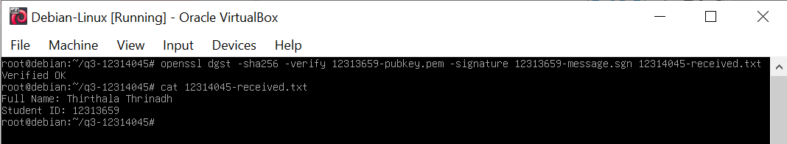

# COIT20262 Advanced Network Security — Week 5 Journal

**Student ID:** 12314045  
**Topic:** Public Key Cryptography, RSA and Digital Signatures

## Work completed

This week focused on **RSA public-key cryptography**, digital signatures and key management. I generated a **2048-bit RSA key pair** using OpenSSL and maintained separate files for the key pair and the public key. Only the public key is intended for sharing. The private key must remain confidential.

The practical work demonstrated two different uses of public-key cryptography:

- **Confidentiality:** encrypt data using the recipient's public key so that only the recipient's private key can decrypt it.
- **Authentication and integrity:** sign a message using the sender's private key and verify the signature using the sender's public key.

For Assignment 1 Question 3, I used the public key of partner student **12313659** as part of the encrypted-message exchange. The AES key and IV were protected with RSA, while the message itself was protected using AES-256-CBC. This hybrid approach combines efficient symmetric encryption with public-key-based key exchange.

## Signature verification

After receiving and decrypting my partner's message, I verified the RSA/SHA-256 signature with:

```bash
openssl dgst -sha256 -verify 12313659-pubkey.pem \
  -signature 12313659-message.sgn 12314045-received.txt
```

The verification result was:

```text
Verified OK
```

I then displayed the decrypted message:

```bash
cat 12314045-received.txt
```

The file contained:

```text
Full Name: Thirthala Thrinadh
Student ID: 12313659
```

The successful `Verified OK` result confirms that the received plaintext matched the content signed by the holder of the corresponding private key and that the signature verification did not detect a change to the signed message.



## Files prepared/checked

```text
12314045-message.txt
12314045-keypair.pem
12314045-pubkey.pem
12314045-key.txt
12314045-iv.txt
12314045-message.sgn
12314045-message.enc
12314045-key.enc
12314045-iv.enc
12314045-received.txt
```

## Key learning

Week 5 connected key management, encryption and digital signatures into one workflow. The most important security rule is that the **private RSA key is never shared**. Public keys can be distributed, but their authenticity should still be verified to prevent substitution by an attacker.
